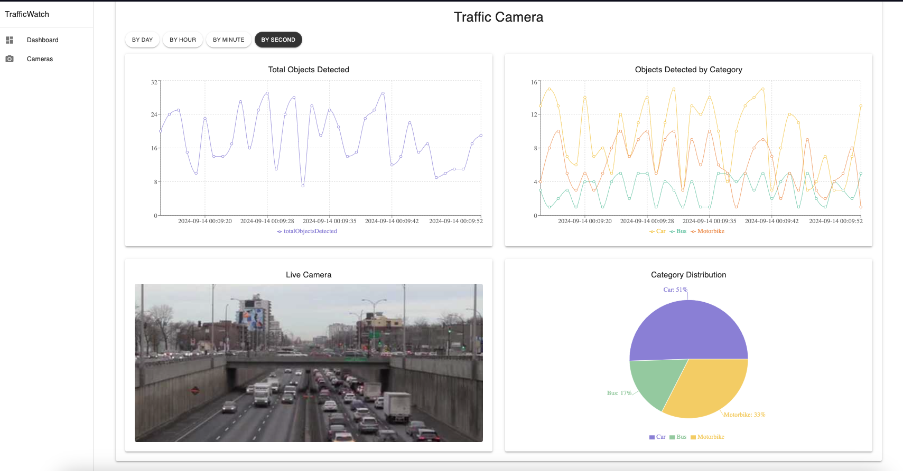

# TrafficWatch

**Author**: Jan Haslik (@janhaslik)

TrafficWatch is a real-time traffic monitoring application that utilizes object detection to count vehicles, such as cars and trucks, across multiple cameras to deliver real-time traffic analytics. This system integrates Kafka for streaming data, Java Spring for backend services, React with WebSocket for real-time display, MongoDB for data storage, and OpenCV, Keras, Tensorflow for computer vision tasks.

Kaggle Dataset for the Object Detection Model: [Click Link](https://www.kaggle.com/datasets/sakshamjn/vehicle-detection-8-classes-object-detection/data)

🚀 **Features**

- **Object Detection (Coming Soon)**: Utilizes OpenCV, Keras, and Tensorflow to detect and count vehicles in camera feeds.
- **Kafka Streaming**: Streams real-time live camera feed & traffic data for efficient and scalable data processing.
- **Dynamic Web Interface**: Built with React and WebSocket to display real-time traffic analytics and camera feeds.
- **Data Storage**: Stores traffic data in MongoDB for historical analysis and reporting.

### UI

Here are some screenshots of the TrafficWatch user interface:

#### Dashboard

#### Dashboard Camera View

#### Camera List

